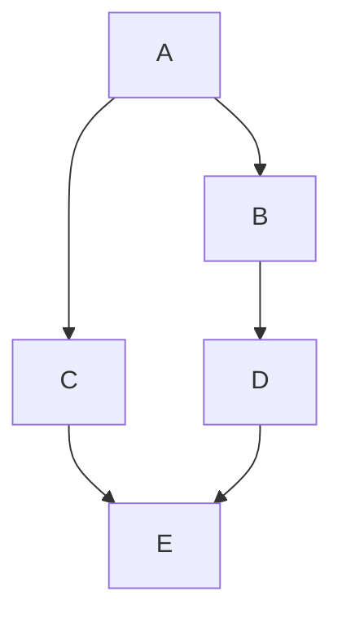

<H2>Google Cloud Patterns</H2>  

More to come, plus I need to work on my markdown 

This repo is a collection of Google Cloud artifacts that have been gathered to develop knowledge management
[Google Reference Architure Center](https://cloud.google.com/architecture)

<H3>Storage</H3>  

  

<h3>SRE</h3>  

  

<H3>MLOps/DataOps</H3>  

  

  

